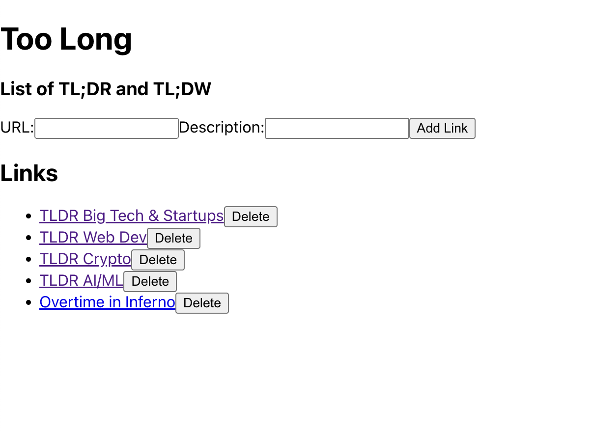
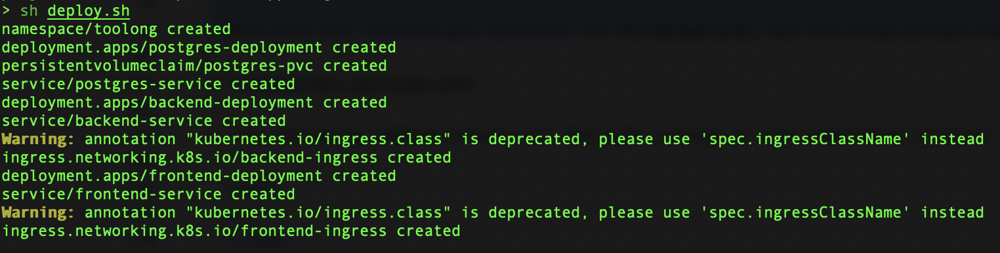
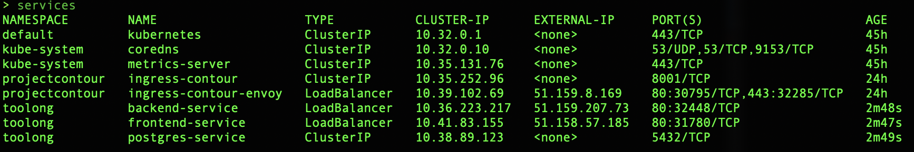
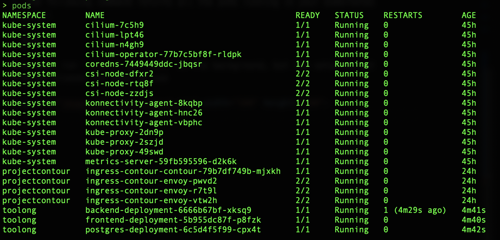

# TooLong 

## Overview 

This is a TL;DR (Too Long Didn't Read) and TL;DW (Too Long Didn't Watch) application made in Go and React.js.

 


### Understand the Go Application

The backend implements three REST APIs including: 

* GET /links - Return current list of links
* POST /links - Add a new link to the list
* DELETE /links/:id - Delete a link from the list

To run the backend application locally, run: 
 ```
    cd too-long-app/backend
    go run main.go 
```

### Understand the ReactJS Application

There is a main part called "App", which renders the main interface for the application. The "LinkForm" allows users to add new linsk and their descriptions. The "LinkList" displays the list of links and their associated descriptions. 

To set up the frontend application locally, run: 
 ```
    cd too-long-app/frontend
    npm install 
    npm start 
```

## Containers

The container images were built with [Cloud-Native Buildpacks](https://buildpacks.io) (CNB) and [Paketo Buildpacks](https://paketo.io).


### Build and Push the Docker images to the OCI Registry 

The OCI Container Regisry is where your Docker images are managed. The Scaleway Container Registry is used for this project.

Run `build.sh` script to build and push the images into the repository

```
./build.sh
```

In a couple of minutes, you should have successfully built and pushed the images into the OCI repository.

## Deployment on Kubernetes 


1. Run the `deploy.sh` script

  ```
  ./deploy.sh
  ```
If everything runs correctly the script will output something like this.


2. Check the status using the following commands

The following command returns the Kubernetes service of MyToDo application with a load balancer exposed through an external API
  ```
  services
  ```
This will run `kubectl get services` in the background, but the setup script creates aliases for ease of use



3. The following command returns all the pods running in your kubernetes cluster:
  ```
  pods
  ```
This will run `kubectl get pods` in the background, but the setup script creates aliases for ease of use

Open the website
  ```
  http://frontend.51.159.8.169.nip.io
  ```




If you make changes to the image, you need to delete the service and the pods by running undeploy.sh then redo Steps 2 & 3.

 Run the `undeploy.sh` script
  ```
  ./undeploy.sh
  ```


