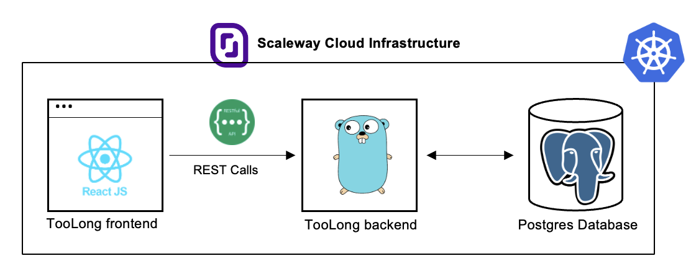
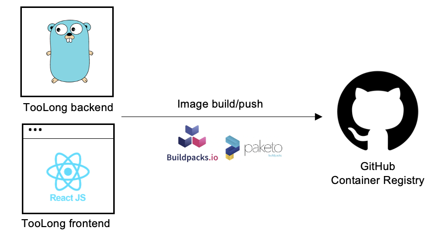

# TooLong 

## Overview 

This is a TL;DR (Too Long Didn't Read) and TL;DW (Too Long Didn't Watch) application made in Go and React.js using the Scaleway Cloud services.


This app uses PostgreSQL Database, the Scaleway Container registry, the Kapsule Kubernetes Cluster and the managed services of the Scaleway Cloud Infrastructure through the deployment.



### Understand the Go Application

The backend implements three REST APIs including: 

* GET /links - Return current list of links
* POST /links - Add a new link to the list
* DELETE /links/:id - Delete a link from the list

To run the backend application locally, run: 
 ```
    cd too-long-app/backend
    go run main.go 
```

### Understand the ReactJS Application

There is a main part called "App", which renders the main interface for the application. The "LinkForm" allows users to add new linsk and their descriptions. The "LinkList" displays the list of links and their associated descriptions. 

To set up the frontend application locally, run: 
 ```
    cd too-long-app/frontend
    npm install 
    npm start 
```

## Containers

The container images were built with [Cloud-Native Buildpacks](https://buildpacks.io) (CNB) and [Paketo Buildpacks](https://paketo.io).

No need to write a `Dockerfile` anymore: using CNB you get
secured up-to-date container images out of your source code.




