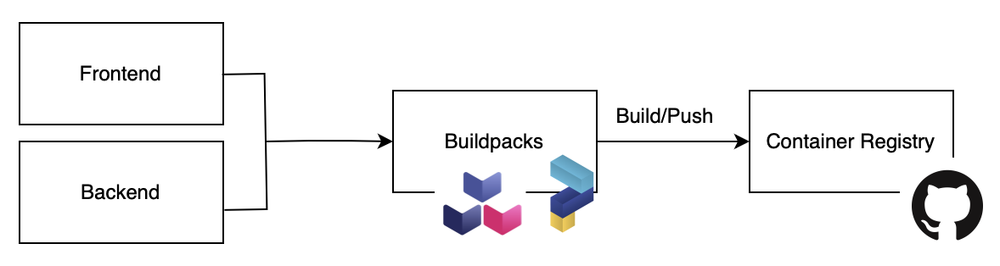

# TooLong 

## Overview 

TooLong is an Application that helps to save different links to review them later. It includes 2 components:

- `backend` is a service managing links (Go) 
- `frontend` is a frontend of the application (React)


All the services are built into Docker images. They have been deployed in a Kubernetes Cluster following the pattern:


Ingress <--> Service <--> Deployment <--> {Secrets}


All the procedure has been tested only on Mac using 
- Docker for Mac
- [Scaleway Kapsule](https://www.scaleway.com/fr/kubernetes-kapsule/)
- Helm
- Contour

## Setup the infrastructure

### Create k8s Cluster

Create a new Kapsule cluster. It deploys Helm & Contour.

Run the following command to create a cluster.
```
scw k8s cluster create name=<cluster_name>
```
You will get a cluster ID. Then run this command to install a KubeConfig configuration file 
```
scw k8s kubeconfig install <cluster_id>
```
The next step is to add a node pool to your K8s cluster.
```
scw k8s pool create cluster-id=<cluster-id> name=<pool_name> node-type=GP1_XS size=number-of-nodes-wanted
```
We are using [Contour](https://github.com/projectcontour/contour/tree/main) as an ingress.

To install Contour, run the following commands
```
helm repo add bitnami https://charts.bitnami.com/bitnami
helm install my-release bitnami/contour --namespace contour --create-namespace
watch kubectl -n contour get po,svc
```

## Build Docker images with Cloud Native Buildpacks

The Docker images are built using the [Cloud Native Buildpack](https://buildpacks.io) and [Paketo Buildpacks](https://paketo.io). 




