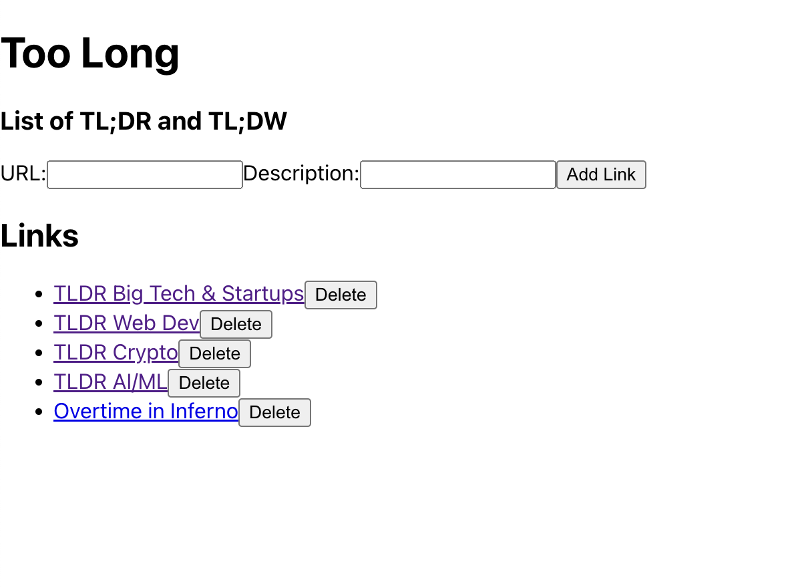
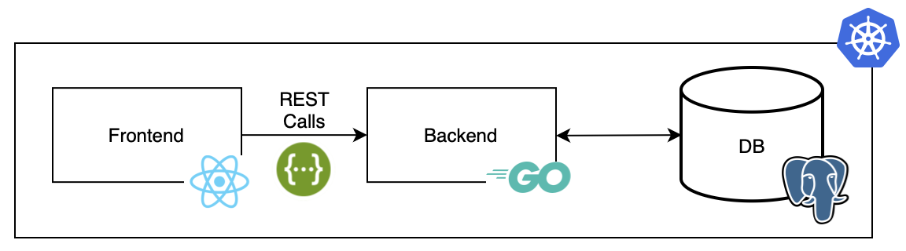

# TooLong 

## Overview 

TooLong is an Application that helps to save different links to review them later. It includes 2 components:

- `backend` is a service managing links (Go) 
- `frontend` is a frontend of the application (React)



All the services are built into Docker images. They have been deployed in a Kubernetes Cluster following the pattern:



All the procedure has been tested on Windows (and Mac) using
- Docker  
- [Tanzu Kubernetes Grid](https://tanzu.vmware.com/kubernetes-grid) (vSphere with Tanzu)
- [Contour](https://projectcontour.io)
- Helm


## Setup the infrastructure

### New Tanzu Kubernetes Cluster

Create a new TKG cluster using the Supervisor cluster and the vSphere with Tanzu namespace.


Edit `k8s/new-tkg-cluster.yaml` and set the values for
- SC_IP 
- NAMESPACE

```
./k8s/new-tkg-cluster.sh 
```

This command will also install [Contour](https://projectcontour.io) in the TKG cluster.

Record the external IP of the envoy service deployed previously
```
kubectl get svc -n projectcontour
...
NAME      TYPE           CLUSTER-IP       EXTERNAL-IP    PORT(S)                      AGE
contour   ClusterIP      10.104.172.208   <none>         8001/TCP                     7d2h
envoy     LoadBalancer   10.108.0.184     172.16.110.7   80:31880/TCP,443:31564/TCP   7d2h
```

### Setup Harbor Registry 


### Cloud Native Buildpacks using pack

Build containers using [Cloud Native Buildpacks](https://buildpacks.io/)(CNB) instead of writting `Dockerfile`. 

This GitHub Actions workflow automates the building and pushing of containers for the Go backend and the React.js frontend to GitHub Container Registry. It triggers on a push to the `main` 

Set a `CR_PAT` token for authenticating with GitHub Container Registry.

Create a `.github/workflows/containers.yml` file in your repository 
```
name: Build Containers

on:
  push:
    branches:
      - main

jobs:
  build:
    runs-on: ubuntu-latest

    steps:
    - name: Checkout code
      uses: actions/checkout@v2

    - name: Install pack CLI
      run: |
        curl -sSL https://github.com/buildpacks/pack/releases/download/v0.23.0/pack-v0.23.0-linux.tgz | tar xz -C /tmp
        mv /tmp/pack /usr/local/bin/pack
      if: runner.os == 'Linux'

    - name: Make pack CLI executable
      run: |
        chmod +x /usr/local/bin/pack
      if: runner.os == 'Linux'

    - name: Build Go Backend Container
      working-directory: path/to/go-backend
      run: |
        pack build ghcr.io/your-username/my-go-backend-image --path . --builder heroku/buildpacks:20
      env:
        PACK_STACK_ID: "heroku-20"
        DOCKER_BUILDKIT: 1

    - name: Build React Frontend Container
      working-directory: path/to/react-frontend
      run: |
        pack build ghcr.io/your-username/my-react-frontend-image --path . --builder heroku/buildpacks:20
      env:
        PACK_STACK_ID: "heroku-20"
        DOCKER_BUILDKIT: 1

    - name: Docker Login
      run: |
        echo $CR_PAT | docker login ghcr.io -u ${{ github.actor }} --password-stdin
      env:
        CR_PAT: ${{ secrets.CR_PAT }}

    - name: Push Go Backend Container
      run: |
        docker push ghcr.io/your-username/my-go-backend-image
      if: success()

    - name: Push React Frontend Container
      run: |
        docker push ghcr.io/your-username/my-react-frontend-image
      if: success()
```

Replace `your-username` with the GitHub username and adjust the paths as needed. 
Commit and push this workflow 

## Deployments 

Deploy the Kubernetes ressources with this command
```
export K8S_NS='default'
kubectl apply -f k8s/postgres.yaml -n ${K8S_NS}
kubectl apply -f k8s/backend.yaml -n ${K8S_NS}
kubectl apply -f k8s/frontend.yaml -n ${K8S_NS}
```

Edit the /etc/hosts file
```
172.16.110.7 frontend.172.16.110.7.nip.io
172.16.110.7 backend.172.16.110.7.nip.io
```

Open the website using the link `http://frontend.172.16.110.7.nip.io/`


## Sources 

- https://core.vmware.com/resource/vsphere-tanzu-quick-start-guide-v1a#_Toc53677570
- https://docs.vmware.com/en/VMware-vSphere/8.0/vsphere-with-tanzu-services-workloads/GUID-EB11DFDE-6ED4-4864-9E60-669F50D64397.html
- https://github.com/bmoussaud/micropets-app
- https://github.com/buildpacks/github-actions


