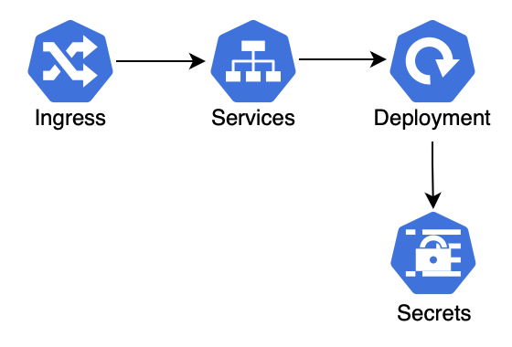

# TooLong 

## Overview 

TooLong is an Application that helps to save different links to review them later. It includes 2 components:

- `backend` is a service managing links (Go) 
- `frontend` is a frontend of the application (React)


All the services are built into Docker images. They have been deployed in a Kubernetes Cluster following the pattern:


Ingress <--> Service <--> Deployment



All the procedure has been tested only on Mac using 
- Docker for Mac
- [Scaleway Kapsule](https://www.scaleway.com/fr/kubernetes-kapsule/)
- Helm
- Contour

## Setup the infrastructure

### New Docker registry

Create a new Docker registry locally using registry.local as DNS name.
```
./k8s/new-docker-registry.sh
```
Edit your local hostname config /etc/hosts
```
127.0.0.1 registry.local
```

### Create k8s Cluster

Create a new Kapsule cluster. It deploys Helm & Contour.

Run the following command to create a cluster.
```
scw k8s cluster create name=$(CLUSTER_NAME)
```
You will get a cluster ID. Then run this command to install a KubeConfig configuration file 
```
scw k8s kubeconfig install $(CLUSTER_ID)
```
The next step is to add a node pool to your K8s cluster.
```
scw k8s pool create cluster-id=$(CLUSTER_ID) name=$(POOL_NAME) node-type=GP1_XS size=number-of-nodes-wanted
```
We are using [Contour](https://github.com/projectcontour/contour/tree/main) as an ingress.

To install Contour, run the following commands
```
helm repo add bitnami https://charts.bitnami.com/bitnami
helm install my-release bitnami/contour --namespace contour --create-namespace
watch kubectl -n contour get po,svc
```

### Building Docker images with kPack

The Docker images are built using the [Cloud Native Buildpack](https://buildpacks.io) and [kpack](https://github.com/buildpacks-community/kpack). 

Install kPack into the cluster
```
kubectl apply  --filename release-<version>.yaml
kubectl get pods --namespace kpack --watch
```

### Build and Push the Docker images to the OCI Registry 

The OCI Container Regisry is where your Docker images are managed. The Scaleway Container Registry is used for this project.

Run `build.sh` script to build and push the images into the repository

```
./build.sh
```

In a couple of minutes, you should have successfully built and pushed the images into the OCI repository.

## Deployment on Kubernetes 

