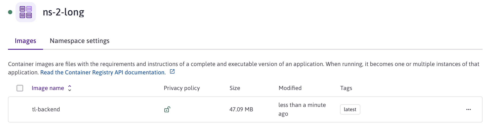
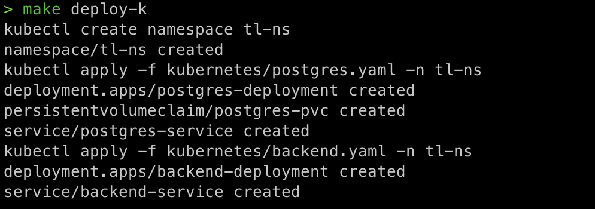
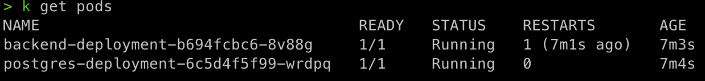

# Deploy the Backend Docker Image to Kubernetes

### Understand the Go backend application 

The backend implements three REST APIs including: 

* Retrieving the current list of links
* Adding a new link 
* Delete a link 

The backend is implemented following Go functions (under ./backend/main.go): 

* main: starts and configure the main entry points
* getLinks 
* createLinks
* deleteLinks

### Objectives

* Build and deploy the Docker image of the application 
* Deploy the image on the Kapsule Kubernetes cluster
* Describe the steps for undeploying
* Test the backend application

## Build and Push the Docker Image on the OCI Registry 

The OCI Registry is where the Docker Images are managed  I use the Scaleway Container Registry. Fot this project, I use the [Cloud-Native Buildpacks](https://buildpacks.io) (CNB) and [Heroku Buildpacks](https://devcenter.heroku.com/articles/buildpacks). So there is no need to write Dockerfiles: with the Buildpacks, i get a secured and up-to-date container images out of my source code.

1. Run `deploy` to build and push the backend image into the registry 

 ```
    cd too-long-app/backend
    make deploy
```

2. Check the container registry



## Deploy on Kubernetes and Check the Status

1. Run the `deploy-k`

  ```
    cd too-long-app/backend
    make deploy-k
  ```
  
  If everything works well, this should be the output.



2. Check the status 

The following command returns the Kubernetes service of MyToDo application with a load balancer exposed through an external API
  ```
  kubectl get services -n tl-ns
  ```


3. The following command returns all the pods running in your kubernetes cluster:
  ```
    kubectl get pods -n tl-ns
  ```



## UnDeploy (optional)

  If you make changes to the image, you need to delete the service and the pods by running `Makefile` then redo Steps 2 & 3.

  1. Run the `undeploy`
  ```
  cd too-long-app/backend
  make undeploy
  ```


